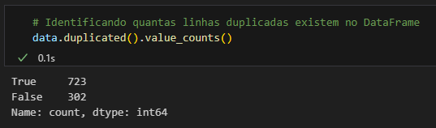
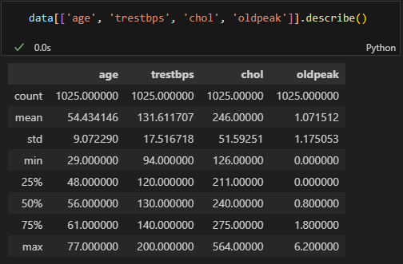
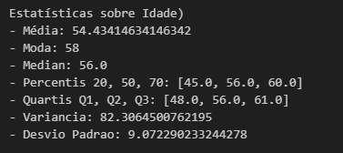
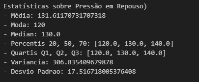
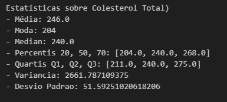
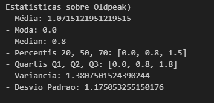

# Etapa de Pré-Processamento com o Heart Discase Dataset
Este Dataset foi criado em 1988 e consiste em quatro bancos de dados: Cleveland, Hungria, Suíça e Long Beach V. Ele contém 76 atributos, incluindo o atributo de target, mas todos os experimentos publicados referem-se ao uso de um subconjunto de 14 deles, incluindo o target. O campo "target" refere-se à presença de doença cardíaca no paciente. É um valor inteiro: 0 = sem doença e 1 = doença.

- [Site do Dataset](https://www.kaggle.com/datasets/johnsmith88/heart-disease-dataset?resource=download)

## 1) Análise da Base 
Os 13 atributos podem ser vistos abaixo:
0. idade - **age**  
1. gênero - **sex**
2. tipo de dor no peito (4 tipos) - **cp**
3. pressão arterial em repouso - **trestbps**
4. colesterol total em mg/dl - **chol**
5. glicemia em jejum > 120 mg/dl? - **fbs**
6. resultados eletrocardiográficos em repouso (values 0,1,2) - **restecg**
7. frequência cardíaca máxima alcançada - **thalach**
8. angina induzida por exercício - **exang**
9. ST depression induced by exercise relative to rest - **oldpeak**
10. a inclinação do segmento ST de pico do exercício - **slope**
11. número de vasos principais (0-3) coloridos pela fluorosopia - **ca**
12. thal: 0 = normal; 1 = fixed defect; 2 = reversable defect - **thal**

O Dataset possui 1025 linhas, nenhum valor não nulo e é composto majoritariamente de valores inteiros (apenas um atributo é do tipo ponto flutuante).
 

Em relação a coluna target, os valores são bem balnaceados, com 526 pessoas possuindo doenças cardíacas e 499 não possuindo.

Vale ressaltar que alguns atributos, como os das colunas 1, 2, 5, 6, 8, 10, 11 e 12, possuem valores numericos representativos, o que significa que o valor numérico em si nao importa e sim o que ele representa (por exemplo, verdadeiro ou falso, masculino ou feminino, tipo de dor no peito, etc). 

Ao fazer algumas análises, percebi que haviam algumas linhas com os exatos mesmos valores. Assim, precisei contá-las e identificá-las. Fiquei em dúvida se tiraria essas linhas, já que os dados de todas as colunas eram exatamente os mesmos, ou se manteria elas, já que podemos considerar que são pessoas diferentes que coincidentemente tiveram os mesmos resultados em tudo. A figura a baixo mostra a quantidade de valores duplicados dentro do DataFrame:

Como existem muitas linhas duplicadas no Dataset, **optei por deixar essas linhas**, uma vez que, se retiradas, seria perdido mais da metade dos dados, o que, em minha visão, não seria vantajoso.

## 2) Exploração Estatística de Atributos Selecionados
Selecionar 4 atributos para fazer os seguintes calculos estatísticos:
- Media 
- Moda 
- Mediana 
- Percentis 20, 50 e 70
- Quartis Q1, Q2, Q3
- Variancia 
- Desvio Padrão

**Escolhidas:** Idade, Oldpeak, Pressão arterial em repouso e Colesterol total em mg/dl.

Antes de fazer a análise individual dos atributos escolhidos, vale ser citado o método `a.describe()`, da biblioteca Pandas, que mostra uma descrição geral dos dados da colunas selecionadas. O método mostra a contagem dos dados, a média, o desvio padrão, o valor mínimo, o valor máximo e os Quartis Q1, Q2 e Q3. Ele será usado como referencia para verificar se os cálculos individuais estão certos.

### Idade (Age)

A idade é relativamente um atributo bem banceado, possui um bom intervalo de valores e uma frequência bem distribuida. 

### Pressão Arterial em Repouso (trestbps)

Podemos perceber, pegando o menor e o maior valor desse atributo, que há um grande intervalo de valores possíveis. Ademais, com a análise dos quartis, é possível perceber que a maioria dos dados se concentram relativamente distantes do valor máximo, justificando o alto valor de dispersão dos dados. Provavelmente o gráfico boxplot desse atributo irá mostrar a caixa de maior concentração dos dados bem perto do eixo y, uma vez que fica bem perto do valor mínimo. Além disso, temos a grande possibilidade de valores outliers. 

### Colesterol Total em mg/dl (chol)

Mesmo caso do atributo anterior. Esse é o que possui o maior intervalo dos atributos escolhidos e com a maioria dos dados se concentrando bem no começo desse intervalo, o que justifica o grande valor de dispersão e resulta em uma maior quantidade de outliers.

### Oldpeak (oldpeak)

Intervalo de valores curtinhos, porém com dados bem mal distribuídos analisando os quartis. A caixa estará colada no valor mínimo uma vez que a maior concentração de dados está entre o valor mínimo e 1,5.

## 3) Visualização e Detecção de Outliers
- BoxPlot: se a caixa for muito pequena quer dizer que há uma grande concentração de dados em um intervalo de variação muito pequeno. O tamanho dos bigodes representa a variação de valores, se ele for longo há uma maior variação, se for curto há uma menor variação.
## 4) Análise de Redundância e Correlação
## 5) Desbalanceamento de Classes
## 6) Proposição de Questões

**1.** Qual a relação do colesterol total com doenças cardiacas (ou seja, target = 1)?

**2.** Qual a relação do entre a pressão arterial em repouso com um diagnóstico de doença cardíaca?

**3.** Há alguma relação de altos valores de oldpeak e um diagnóstico de doença cardíaca?

**4.** É possivel arfirmar que pessoas acima de 60 anos com colesterol alto têm mais tendencia a problemas de coração?