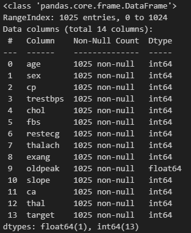
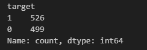

# Etapa de Pré-Processamento com o Heart Discase Dataset
Este Dataset foi criado em 1988 e consiste em quatro bancos de dados: Cleveland, Hungria, Suíça e Long Beach V. Ele contém 76 atributos, incluindo o atributo de target, mas todos os experimentos publicados referem-se ao uso de um subconjunto de 14 deles, incluindo o target. O campo "target" refere-se à presença de doença cardíaca no paciente. É um valor inteiro: 0 = sem doença e 1 = doença.

- [Site do Dataset](https://www.kaggle.com/datasets/johnsmith88/heart-disease-dataset?resource=download)

## 1) Análise da Base 
Os 13 atributos podem ser vistos abaixo:
0. idade - **age**  
1. gênero - **sex**
2. tipo de dor no peito (4 tipos) - **cp**
3. pressão arterial em repouso - **trestbps**
4. colesterol total em mg/dl - **chol**
5. glicemia em jejum > 120 mg/dl? - **fbs**
6. resultados eletrocardiográficos em repouso (values 0,1,2) - **restecg**
7. frequência cardíaca máxima alcançada - **thalach**
8. angina induzida por exercício - **exang**
9. ST depression induced by exercise relative to rest - **oldpeak**
10. a inclinação do segmento ST de pico do exercício - **slope**
11. número de vasos principais (0-3) coloridos pela fluorosopia - **ca**
12. thal: 0 = normal; 1 = fixed defect; 2 = reversable defect - **thal**

O Dataset possui 1025 linhas, nenhum valor não nulo e é composto majoritariamente de valores inteiros (apenas um atributo é do tipo ponto flutuante).
 

Em relação a coluna target, os valores são bem balnaceados, com 526 pessoas possuindo doenças cardíacas e 499 não possuindo.

Vale ressaltar que alguns atributos, como os das colunas 1, 2, 5, 6, 8, 10, 11 e 12, possuem valores numericos representativos, o que significa que o valor numérico em si nao importa e sim o que ele representa (por exemplo, verdadeiro ou falso, masculino ou feminino, tipo de dor no peito, etc). 

### Analisando a partir de angina induzida por exercício (exang = 1)

- Verificar primeiro quantas pessoas no geral que possuem exang 1 estão doentes e qual a faixa etária. Verificar a porcentagem.
- Depois verificar qual o tipo de dor elas sentem durante esse exercicio, tanto para as pessoas doentes quanto para as não doentes 

### Algumas conclusões
- Possivelmente há uma alta correlação do oldpeak e do target

## 2) Exploração Estatística de Atributos Selecionados
Selecionar 4 atributos para fazer os seguintes calculos estatisticos:
- Media 
- Moda 
- Mediana 
- Percentis 20, 50 e 70
- Quartis Q1, Q2, Q3
- Variancia 
- Desvio Padrão

**Escolhidas:** Idade, Oldpeak, pressão arterial em repouso  
